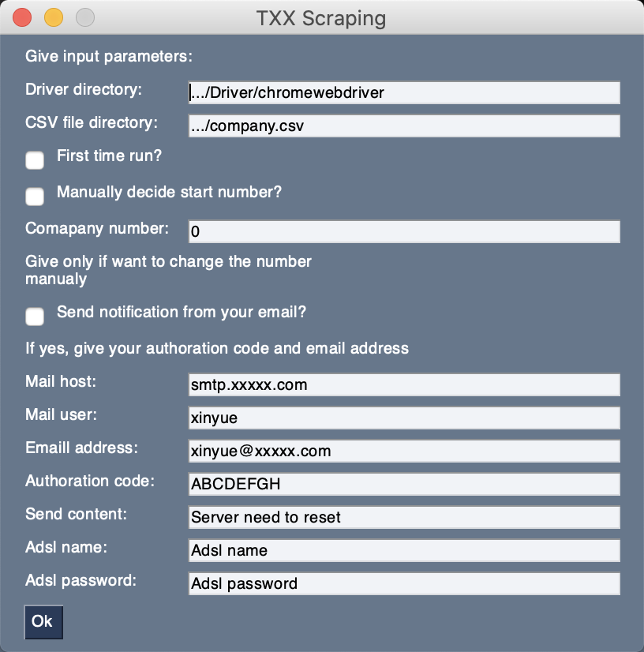

# CompanySracper

# Helping files

### Emailme.py
 check if the process is running in 2 minues. Will send an inform email to the user if the process stopping running.
### Dynamic_connect.py
 connect to the internet on virture machine server in order to change ip.
### webcomp_UI.py
 collect parameters for the main code.
 
 
 
### Decode.py
 Change the encoded data number back to real number.
 
# Main code
 This is a acedamic research project which uses Selenium web scarpy TianyanX commercial informations.
 
### Company_Scrapy.py
### Company_Scrapy_copy.py
Same code, Company_Scrapy.py is used to support UI. Company_Scrapy_copy.py can be used without UI and run perfectly.

 Main code includes:
 - Check if need to change ip (Only change IP if the previous driver closed is casued by robot detection).
 - Search the company and click the first result (according to the website, the first result will be closest to your search name).
 - Robot checking solution: if the website pop out the robot checking box, close current browser and change ip.
 - Find all useful infomation tables and save as .csv file
 - Find the .ttf font file to prepare for decoding.
 - Close extra handles.
 - Quit driver if there is robot detection.
 ### Data cannot be used for commercial reason!
 ### With some reasons, full code will not be posted.
 

 # VPS-Virtual Private Server
 
 A virtual private server (VPS) is a virtual machine sold as a service by an Internet hosting service. The virtual dedicated server (VDS) also has a similar meaning. (Wikipedia: https://en.wikipedia.org/wiki/Virtual_private_server)
 
 This main code with ADLS help code need to be run on VPS to change the IP.
 
 
## Author:
 Xinyue Zhang
